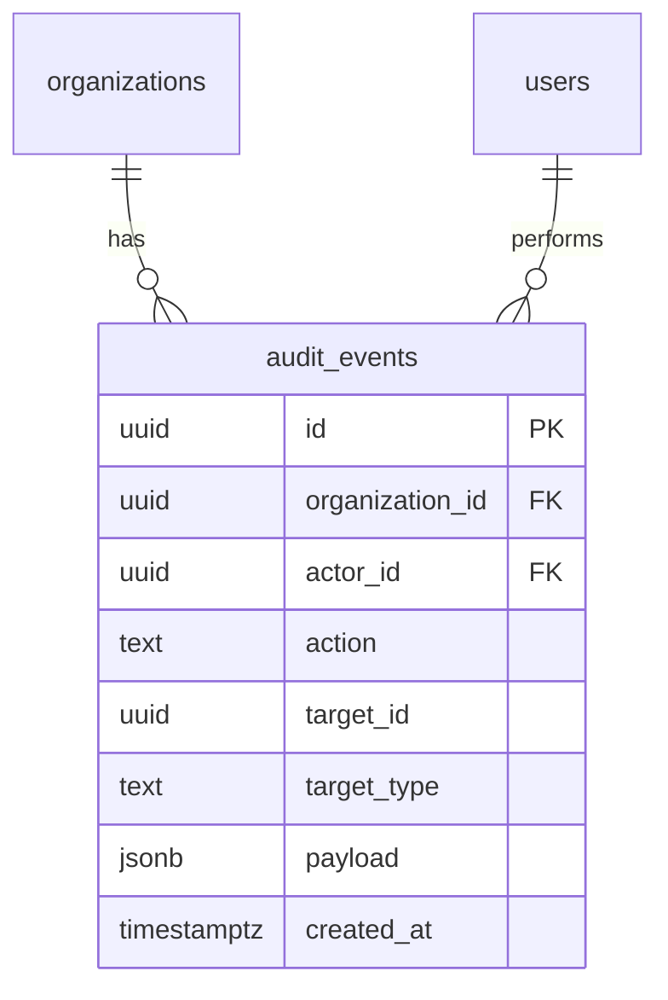

# Audit events — schema

## Notes

- `payload` is intentionally untyped JSONB — admin actions vary widely; structured columns would force a schema-per-action.
- Index on `(organization_id, created_at desc)` is the only one we add in v1; viewer queries are always filtered by org first.
