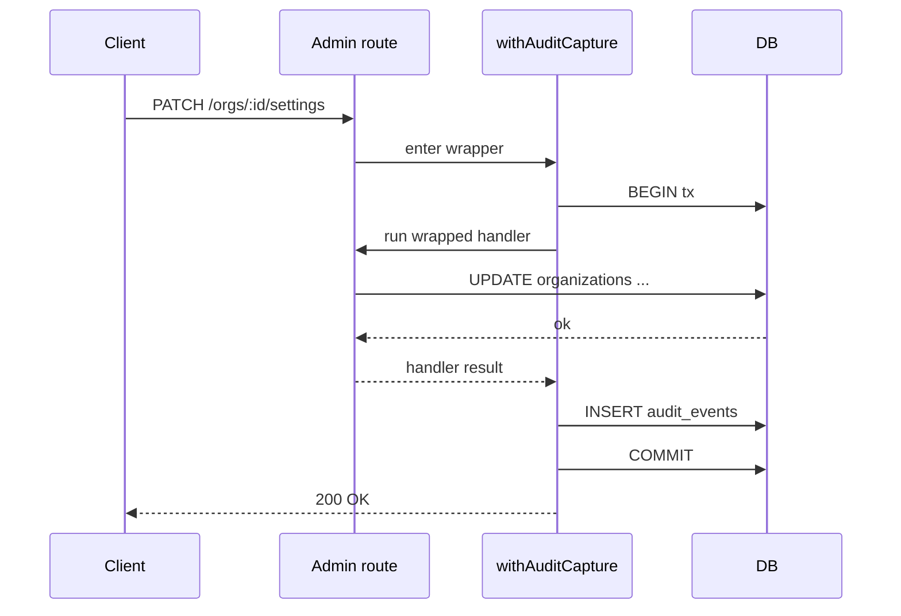

# API — admin route audit envelope

The middleware does not expose new endpoints; it instruments existing ones. The contract describes the *envelope* every wrapped admin route adopts.

## Action contract

```ts
type AdminAction =
  | "user.invited"
  | "user.removed"
  | "user.role_changed"
  | "org.settings_updated"
  | "billing.plan_changed";
```

Routes register their action statically. Example:

```ts
export const PATCH = withAuditCapture("org.settings_updated", patchOrgSettings);
```

## Captured payload shape

```ts
type AuditPayload = {
  changes?: { field: string; before: unknown; after: unknown }[];
  batch_id?: string;
  mode?: "soft" | "hard";        // only for action === "delete"
  target: { type: string; id: string };
};
```

`changes` is a structured diff. Sensitive fields (password hashes, API keys) are redacted to `"[redacted]"` before storage.

## Sequence


